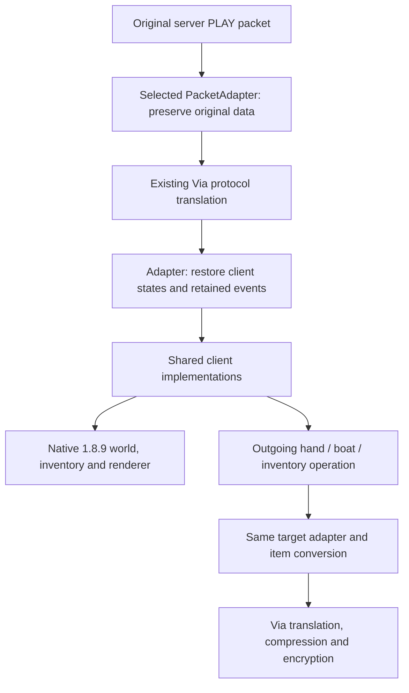

# Compatibility pipeline

The connection's server version, packet codec, client behavior and resource
release are independent. Existing 1.9?1.12.2 implementations now also run on
explicit 1.13?1.13.2 and 1.14?1.14.4 adapters. These registrations restore the
inherited catalog; they do not implement all content introduced in those releases.
Unknown targets retain normal Via connectivity without borrowing an older parser.
See [flattened families and validation limits](FLATTENED.md).

## Connection and packet flow

`CompatibilityRegistry` resolves an exact server protocol to an immutable
`CompatibilityProfile`. The profile contains:

- The real negotiated `serverProtocol`, retained throughout the connection.
- Cumulative `VersionRules`: enabled `ClientFeature` modules, content availability
  and named `ClientRule` overrides.
- A `ResourceProfile`: exact vanilla asset release and resource-layout converter.
- A `ProtocolAdapterFactory`: supported capabilities, connection-owned inbound
  codec/state, bidirectional item identity conversion and outgoing operations.

The resolved profile is stored on Via's `UserConnection`. Both packet directions
use that object. A target mismatch after a server change discards the old selection.

`CompatibilityDecodeHandler` owns transport concerns: compression reordering,
channel ownership, packet validation, buffers, Via cancellation, restoration,
failure fallback and closing. It has no legacy packet IDs or resource selection.
`LegacyProtocolAdapter` contains the existing block/entity wire readers and
connection-local `LegacyBlockWorld`. `LegacyServerboundPackets` contains the
1.9-boundary hand/boat encoders previously embedded in input classes.

Adapters inspect original data **before** Via can replace/drop it. Retained events
survive a cancelled Via packet, while events with a native implementation replace
the fallback to avoid duplicate effects. Packet methods borrow their input and
transfer ownership of returned buffers to the shared decoder. An adapter failure
clears its cached state and retains normal Via translation for that connection.

## Reuse and version overrides

`LegacyCompatibility` builds the current family cumulatively:

1. 1.9 supplies blocks, items, entities/mobs, two hands, boats, combat and cooldowns.
2. 1.10 adds its catalog revision and crystal-beam rule.
3. 1.11 adds Totems and changed gateway, boat, shulker and entity-name rules.
4. 1.11.1 changes the dragon-head item orientation and attack indicator.
5. 1.12 adds its content and changed colors, Creative categories, oar cycle and
   illager arm model.

Patch profiles reuse those rules while selecting their own wire layout and
resources. `VersionRules.derive()` copies the parent; changing the child cannot
mutate it. A later family can retain two hands, boats and other implementations,
then override individual rules. Features declare dependencies, and profile
construction rejects capabilities that the selected adapter cannot supply.

Runtime modules use `ServerSession.has(feature)` and named behavior rules.
`contentSince(revision)` is reserved for introduction revisions of existing
catalog entries; it is **not** a network protocol comparison or codec selection.
The deprecated `ServerBlockSession`/`BlockPreservingDecodeHandler` constructors
remain only as compatibility entry points for older fixtures.

## Shared client data boundary

The current client item catalog has a stable internal legacy ID/data namespace.
`ItemDataAdapter` translates server identity/NBT into that namespace before native
registration lookup, and converts it back before serverbound encoding. Forge's
local registry IDs must never reach the remote endpoint. Existing item snapshots
still preserve information before individual Via item rewriters discard it.

`ClientEventEnvelope` declares an internal `ClientEventFormat` separately from
`ServerSession.profile().serverProtocol()`. Current formats retain the established
1.9?1.12 payload layouts so the existing entity, inventory and effect consumers
remain reusable. A newer adapter can emit normalized events in that format; it
must translate metadata indices, IDs and sound registry entries first. It must
not write a modern server protocol number onto an unconverted payload and let
legacy consumers guess its layout. Entity behavior uses the actual session rules.

This is a staged normalization boundary, not a claim that every future block or
entity is already represented. New content still needs client registrations and
rendering/interaction support. The legacy adapter's fixed-height state store is
not imposed by the generic PacketAdapter interface.

## Resources and lifecycle

Resources are converted into the renderer's expected layout before publication.
They are selected explicitly for each target, independently of inherited behavior.
The original verified download/cache machinery remains in use.
`SessionEpoch` issues a fresh ticket for every join, even on the same connection.
A background resource completion is applied only if its exact ticket is current.
Disconnect and server changes invalidate pending work; a late close from an old
connection cannot clear the new session. World unloading clears the shared client
entity, item, hand, cooldown and boat state as before.

## Registered flattened families

`FlattenedProtocolAdapter` observes the actual `AbstractProtocol.transform` pass.
The 1.13 boundary retains original flattened blocks (including bed colors) and
cloud particles; the subsequent 1.12.2 boundary emits the established internal
client events after Via has normalized entity/item/metadata/sound IDs. The
1.14 boundary additionally retains original block identities before approximate
mappings, using `VillageBlockData`. Chunk light remains owned by Via's original
translation. No stateful protocol is replayed on a probe connection or packet.

`FlattenedItemDataAdapter` uses the connection's bidirectional item rewriters on
copies. `FlattenedItemSnapshot` and the existing legacy snapshots retain original
NBT and identity across lossy steps. A targeted structure-packet conversion fixes
the missing mirror/rotation fields in the bundled ViaBackwards version.

Profiles inherit the earlier behavior and select exact verified archives plus
`FlattenedResourceConverter` or `VillageResourceConverter`. Texture paths, block
variants, parent/texture references, renamed item models and particle atlases are
converted from the target's original resources before publication.

The next unregistered family is 1.15. It requires verified original archives,
changed chest textures/models, chunk biome data and spawn/join formats before
registration. Later families require their own data-preservation boundaries;
1.18's heights and 1.20.5's item components cannot be parsed as legacy formats.
No nearest-version fallback or automatic enabling of unknown formats is used.

## Verification

`CompatibilityArchitectureTest` checks independent target/resources/codec/rules,
immutable inheritance and overrides, capabilities/dependencies, unknown/native
versions, item copy semantics, connection-bound outgoing routing and stale resource
tickets. `CompatibilityDecodePipelineTest` uses a deliberately synthetic wire
format to check preservation before loss, restoration, cancellation, buffer
ownership, disabled-codec fallback and decoder reordering. These are architecture
fixtures, not a claim of real 1.13 support.

The existing Forge smoke suite now creates `CompatibilityDecodeHandler` through
the same registry and adapter factory as production for all ten legacy profiles and eight flattened targets.
Its actual chunk, item, entity, hand, boat, UI, effect and model checks remain in
place. Read `build/logs/block-client-smoke-test.txt`: it must begin with `PASS`.

`FlattenedCompatibilityTest` verifies exact registration and non-consuming packet
observation. `FlattenedPipelineSmokeTest` uses actual compressed target packet
formats through every installed Via layer, the real Forge mixins and native
block/item decoders. It checks original archives and baked models, separate 1.14
light, offhand/player/mob events, both item/hand directions, structure packets,
block entity NBT, unload and dimension cleanup. See `FLATTENED.md` for the precise
coverage and the distinction from live server gameplay.
